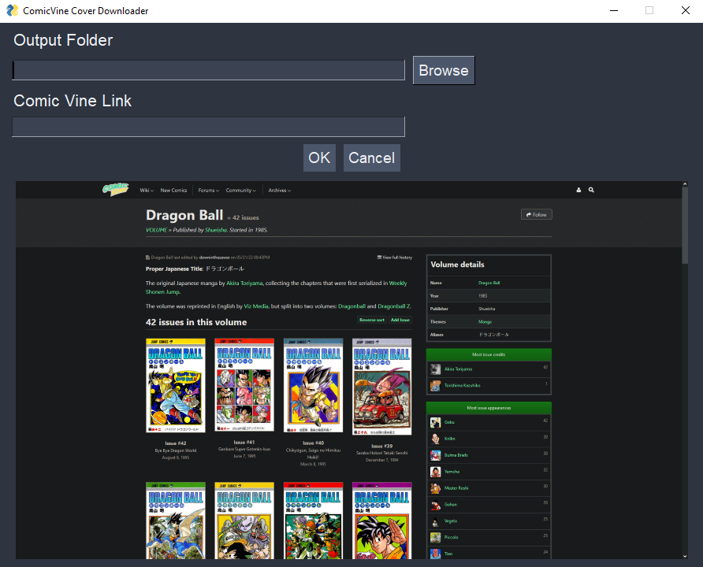

# ComicVineCover

ComicVineCover is a Python program that uses web scraping to effortlessly fetch comic book and manga covers from Comic Vine.

## How It Works

ComicVineCover employs Python libraries like Beautiful Soup and Requests to navigate Comic Vine's website, locate cover images, and download them to your designated directory.

## Usage

1. Clone the repository.
2. Install required libraries using: `pip install -r requirements.txt`.
3. Run the program and follow the prompts to input your search criteria.
4. Enjoy a collection adorned with stunning comic and manga covers!

Please be mindful of copyright and usage rights when using downloaded images. Keep in mind that website changes may affect the program's functionality.

Feel free to contribute, and happy collecting!
